<!-- Upload this README and the accompanying assets/ folder to PranavAvasthi/PranavAvasthi. -->

<a href="https://pranavavasthi.vercel.app/">
  <picture>
    <source media="(max-width: 600px)" srcset="./assets/profile-header-mobile.svg" />
    
  </picture>
</a>

  <a href="https://pranavavasthi.vercel.app/"><b>Portfolio ↗</b></a>
  &nbsp; · &nbsp;
  <a href="https://www.linkedin.com/in/pranav-avasthi-077983228/">LinkedIn</a>
  &nbsp; · &nbsp;
  <a href="mailto:pranavavasthi44@gmail.com">Email</a>

### I think in systems. I ship for people.

I'm **Pranav**, a **Software Engineer III at GeekyAnts**, building **React Native and Next.js** applications. I own technical scope across web and mobile, from architecture decisions to production. My attention goes to the details people actually feel: how quickly a screen responds, how naturally it moves, and how reliably it works.

**2.5+ years of professional experience** &nbsp; · &nbsp; **4+ production apps on the App Store & Google Play**

### What I bring to a codebase

- **Clear boundaries.** Deliberate state ownership, reusable components, and predictable API contracts.
- **Care for the experience.** Performance measured before tuning; accessibility and motion treated as part of the interface.
- **Shared ownership.** Thoughtful reviews, mentoring, and coordination across design, backend, web, and mobile.

### Tools I work with

| Area | Core stack |
| :--- | :--- |
| **Mobile** | React Native · Expo · Reanimated · NativeWind |
| **Web** | Next.js · React · TypeScript · Tailwind CSS |
| **State & data** | Redux Toolkit · TanStack Query · Firebase |
| **Quality & delivery** | Jest · Git · EAS Build |

### Things I've shared

- **Writing** · [Implementing RTL in React Native Expo](https://geekyants.com/en-in/blog/implementing-rtl-right-to-left-in-react-native-expo---a-step-by-step-guide)
- **Teaching** · [Integrating Cashfree Payments with React Native Expo](https://youtu.be/QY-ZcG9CErk)

---

  Thoughtful by design. Curious by default. 
  <a href="mailto:pranavavasthi44@gmail.com">Let's build something worth caring about.</a>

